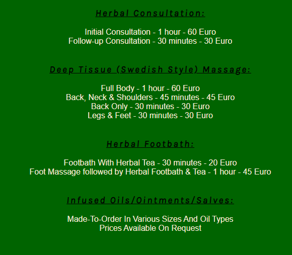
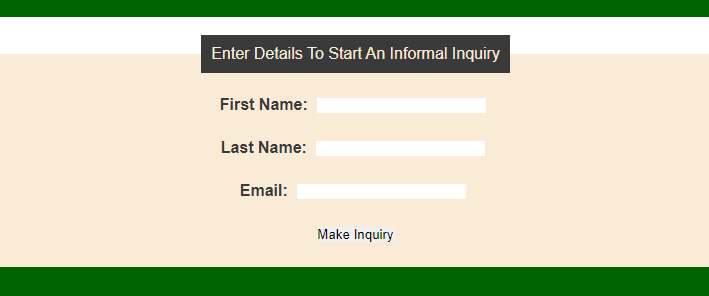
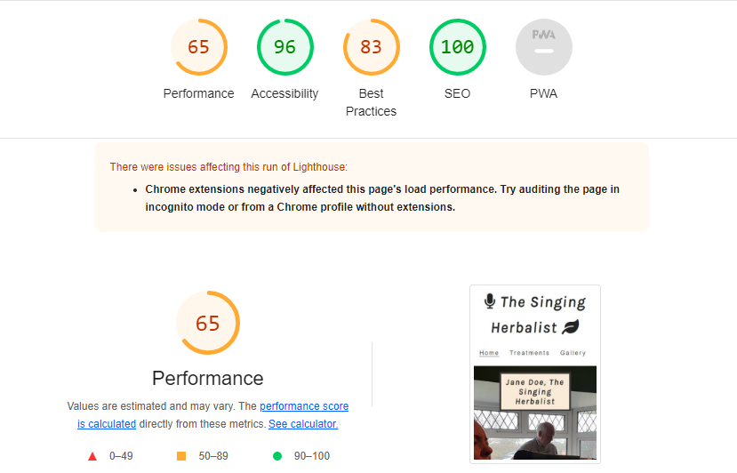

# The Singing Herbalist

## Introduciton to the website:

The Singing Herbalist website is a landing page for people who are interested in herbal treatments and consultations in East Clare, Ireland. The Singing Herbalist offers professional yet caring therapies for individuals looking for a herbal consultation, massage therapy or singer!

Users of this website will be able to find all the information they need to know about the Singing Herbalist, about the available treatments, pricing and contact information. There is an inquiry form for users who wish to start the process of an informal query with the Singing Herbalist.

# /* am i responsive screen shot to go here */

## Features:

### Navgation

Featured at the top, to the right of each of the websites three pages are navigation links to: Home, Treatments and Gallery. 

The logo located in the top left hand corner when clicked will navigate back to the Home page from the two other page in the website.

The navigation is in a color that contrasts with the background.

### The Treatment Menu

This is very useful for the user as it shows them exactly what type of treatments are available at The Singing Herbalist's clinic, the duration of each treatment and the price.

### The Inquiry Form

This form allows the user to make an informal inquiry to The Singing Herbalist, especially if requested a made-to-order oil, ointment or salve.

The form will not submit without an email address in the email field. Also there is a color change when the mouse is hovered over the input fields for First Name, Last Name, Email and also the Make Inquiry button.

### The Footer

The footer is present at the end of all three of the wenbsites pages. It provides the user with a phone number and email address for The Singing Herbalist and encourages users to contact them. 

The footer also includes social media icons that open in a new tab when clicked to allow users to find The Singing Herbalist on Facebook, YouTube and Instagram without navigating away from their website.

## Testing:

I confirm that navigation, header, home, treatments and gallery pages are all easy to understand. All are readable.

I confirm the website works in Chrome, Safari and Firefox.

I have confirmed that the form will only accept an email in the email field and that the Make Inquiry button is functional. I have confirmed that the input fields and button have a color change when the mouse is hovered over them.

I confirm that the social media icons in the footer of each page work, and that they all open in a new tab on the browser window.

I confirm that the video plays in the browser.

I confirm that the project is responsive and works on all standard screen sizes using the dev tools device toolbar.

## Bugs:

## Validator Testing:

### Unfixed Bugs

No unfixed bugs to the best of my knowledge.

## Deployment:

## Credits:

### Content

The code to create the social media links and their style was taken from Code Institute's Love Running project.

The code to style the gallery images was taken from Code Institute's Love Running project.

The input styling and also video styling were taken from https://www.w3schools.com 

The styling for fieldset and legend were partially taken from https://www.w3schools.com

### Media

The video was taken from https://www.youtube.com/

## Validator Testing:

### HTML
No errors or warnings were noted when passing through the official W3C validator.

### CSS
No errors were noted when passing through the Jigsaw, CSS offical validator.

### Accessibility
I confirm that colors and fonts are easy to read and also that the accessiblity is high as can be seen in the below screenshot taken about it was ran through lighthouse in dev tools.

